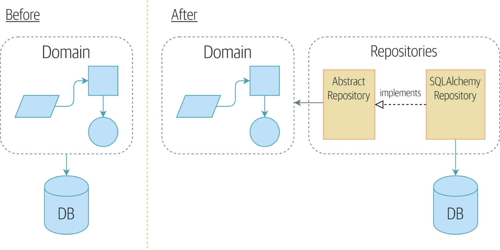

# blog_repository
This this the demo sample for DeepLearning in Action course in SCNU.
## Repository Pattern
Repository pattern, a simplifying abstraction over data storage, allowing us to decouple our model layer from the data layer. We'll present a concrete example of how this simplifying abstraction makes our system more testable by hiding the complexities of the database.

