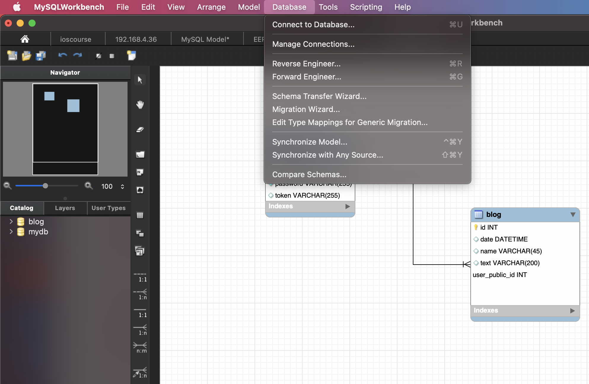

# blog_repository
This this the demo sample for Flask/SQLAlchemy/jwt/Blueprint/Repository Pattern/Flask App Deploymemnt.
## Repository Pattern
Repository pattern, a simplifying abstraction over data storage, allowing us to decouple our model layer from the data layer. We'll present a concrete example of how this simplifying abstraction makes our system more testable by hiding the complexities of the database.


This demo project use inject package for dependency injection. First, we import inject, then inject should be configured:
```
import inject

def config_ioc(binder):
    blog_repository = BlogRepository()

    blog_serivce = BlogService()

    blog_bind = db.BlogSQL

    binder.bind(BlogRepository,blog_repository)

    binder.bind(BlogService,blog_serivce)

    binder.bind(db.BlogSQL,blog_bind)

inject.configure(config_ioc)

```
if you want to inject an instance:
```
blog_service = inject.instance(BlogService)
```

if you want to inject an object attribute:
```
class BlogService: 

    blog_repository = inject.attr(BlogRepository)

    def getall(self) -> typing.List[Blog]:
        list = self.blog_repository.all()
        return list

```

## Design table relations in MySQLWorkBench
connect to your mysql server by using mysqlworkbench. From "Database" menu, choose "Reverse Engineer", follow the command direction, this will create Enhanced Entity-Relationship (EER) diagrams.


we define a one to many relation between table user and blog, this will create a foreign key and a relation in table blog:  


when finished, choose "Forward Engineer" from "Database" menu, this will change the table schemas according to the EER diagram, choose "Synchronize Model" from "Database" menu, the modification will take effect in database engine.



table schemas changed:


you can design table relations online like mysqlworkbench EER diagram in http://vertabelo.com and export the relations to XML file, then using github repo: https://github.com/Vertabelo/vertabelo-sqlalchemy to generate sqlalchemy model files.

we define our sqlalchemy User model:

```
from sqlalchemy import Column
from sqlalchemy.types import String, Integer
from sqlalchemy.orm import relationship
from models import BaseModel 

class User(BaseModel):
    __tablename__ = 'user'
    public_id = Column(Integer, primary_key=True, autoincrement=True)
    name = Column(String(255))
    password = Column(String(255))
    token = Column(String(255))

    fk_blog = relationship('Blog',back_populates="fk_blog_user", cascade="all, delete")

    def __repr__(self):
        return "<Blog(id='%s', name='%s', password='%s', token='%s'>" % (
                                self.public_id, self.name, self.password, self.token)
    def to_json(self):
        return ["id:",self.public_id,"name:", self.name, "password:", self.password, "token:", self.token ]

```

Blog model:

```
from sqlalchemy import Column, ForeignKey, Table
from sqlalchemy.types import String, Integer
from sqlalchemy.orm import relationship
from models import BaseModel 

class Blog(BaseModel):
    __tablename__ = 'blog'
    id = Column(Integer, primary_key=True, autoincrement=True)
    date = Column(String(255))
    name = Column(String(255))
    text = Column(String(255))

    # ForeignKey identify the user this blog belongs to. This is a 1-many relation
    # inside ForeignKey('user.public_id'), user.public_id is tablename_col_name, so must be lower case(not the Classname.attr)
    user_public_id = Column(Integer, ForeignKey('user.public_id'))
    # in relationship, parameter is the Class name, so must be uppercase(Object name) 
    fk_blog_user = relationship("User", foreign_keys=user_public_id, back_populates="fk_blog")

    def __repr__(self):
        return "<Blog(id='%s', date='%s', name='%s', text='%s'>" % (
                                self.id, self.date, self.name, self.text)
    def to_json(self):
        return ["id:",self.id,"date:", self.date, "name:", self.name, "text:", self.text ]

```

this is a one to many relation with delete cascade option.

