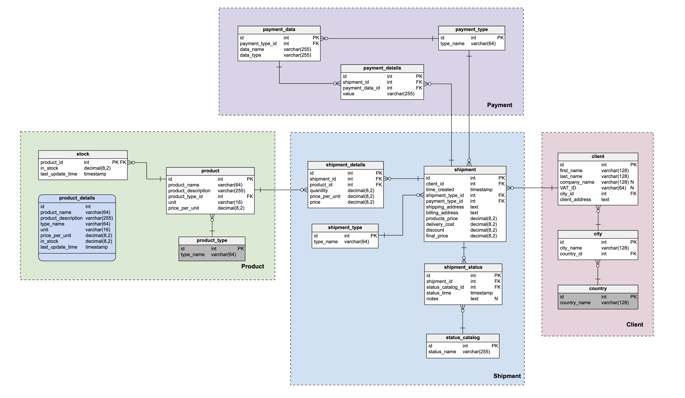

# Product shipment EER disgram and its model
vertabelo sample physical model:



download this model to xml and generate sqlalchemy model by:
```
python3 vertabelo_sqlalchemy.py -i MySQL_demo_physical_data_model.xml -o MySQL_demo_physical_data_model.py
```

the generated model code:

```
# -*- encoding: utf-8 -*-
# begin

import sqlalchemy
from sqlalchemy import create_engine
from sqlalchemy.ext.declarative import declarative_base
from sqlalchemy import Column, Integer, BigInteger, String, ForeignKey, Unicode, Binary, LargeBinary, Time, DateTime, Date, Text, Boolean, Float, JSON
from sqlalchemy.orm import relationship, backref, deferred
from sqlalchemy.orm import sessionmaker

Base = declarative_base()


class Product (Base):
    __tablename__ = "product"
    id = Column('id', Integer, primary_key = True)
    product_name = Column('product_name', Unicode)
    product_description = Column('product_description', Unicode)
    product_type_id = Column('product_type_id', Integer, ForeignKey('product_type.id'))
    unit = Column('unit', Unicode)
    price_per_unit = Column('price_per_unit', BigInteger)

    product_type = relationship('ProductType', foreign_keys=product_type_id)

class ProductType (Base):
    __tablename__ = "product_type"
    id = Column('id', Integer, primary_key = True)
    type_name = Column('type_name', Unicode)

class Stock (Base):
    __tablename__ = "stock"
    product_id = Column('product_id', Integer, ForeignKey('product.id'), primary_key = True)
    in_stock = Column('in_stock', BigInteger)
    last_update_time = Column('last_update_time', Time)

    product = relationship('Product', foreign_keys=product_id)

class Shipment (Base):
    __tablename__ = "shipment"
    id = Column('id', Integer, primary_key = True)
    client_id = Column('client_id', Integer, ForeignKey('client.id'))
    time_created = Column('time_created', Time)
    shipment_type_id = Column('shipment_type_id', Integer, ForeignKey('shipment_type.id'))
    payment_type_id = Column('payment_type_id', Integer, ForeignKey('payment_type.id'))
    shipping_address = deferred(Column('shipping_address', Text))
    billing_address = deferred(Column('billing_address', Text))
    products_price = Column('products_price', BigInteger)
    delivery_cost = Column('delivery_cost', BigInteger)
    discount = Column('discount', BigInteger)
    final_price = Column('final_price', BigInteger)

    client = relationship('Client', foreign_keys=client_id)
    shipment_type = relationship('ShipmentType', foreign_keys=shipment_type_id)
    payment_type = relationship('PaymentType', foreign_keys=payment_type_id)

class Client (Base):
    __tablename__ = "client"
    id = Column('id', Integer, primary_key = True)
    first_name = Column('first_name', Unicode)
    last_name = Column('last_name', Unicode)
    company_name = Column('company_name', Unicode)
    vat_id = Column('VAT_ID', Unicode)
    city_id = Column('city_id', Integer, ForeignKey('city.id'))
    client_address = deferred(Column('client_address', Text))

    city = relationship('City', foreign_keys=city_id)

class City (Base):
    __tablename__ = "city"
    id = Column('id', Integer, primary_key = True)
    city_name = Column('city_name', Unicode)
    country_id = Column('country_id', Integer, ForeignKey('country.id'))

    country = relationship('Country', foreign_keys=country_id)

class Country (Base):
    __tablename__ = "country"
    id = Column('id', Integer, primary_key = True)
    country_name = Column('country_name', Unicode)

class ShipmentDetails (Base):
    __tablename__ = "shipment_details"
    id = Column('id', Integer, primary_key = True)
    shipment_id = Column('shipment_id', Integer, ForeignKey('shipment.id'))
    product_id = Column('product_id', Integer, ForeignKey('product.id'))
    quanitity = Column('quanitity', BigInteger)
    price_per_unit = Column('price_per_unit', BigInteger)
    price = Column('price', BigInteger)

    shipment = relationship('Shipment', foreign_keys=shipment_id)
    product = relationship('Product', foreign_keys=product_id)

# e.g. send after payment, charge after delivery, ...
class ShipmentType (Base):
    __tablename__ = "shipment_type"
    id = Column('id', Integer, primary_key = True)
    type_name = Column('type_name', Unicode)

# e.g. card, cash, paypal, wire transfer
class PaymentType (Base):
    __tablename__ = "payment_type"
    id = Column('id', Integer, primary_key = True)
    type_name = Column('type_name', Unicode)

class PaymentData (Base):
    __tablename__ = "payment_data"
    id = Column('id', Integer, primary_key = True)
    payment_type_id = Column('payment_type_id', Integer, ForeignKey('payment_type.id'))
    data_name = Column('data_name', Unicode)
    data_type = Column('data_type', Unicode)

    payment_type = relationship('PaymentType', foreign_keys=payment_type_id)

class PaymentDetails (Base):
    __tablename__ = "payment_details"
    id = Column('id', Integer, primary_key = True)
    shipment_id = Column('shipment_id', Integer, ForeignKey('shipment.id'))
    payment_data_id = Column('payment_data_id', Integer, ForeignKey('payment_data.id'))
    value = Column('value', Unicode)

    shipment = relationship('Shipment', foreign_keys=shipment_id)
    payment_data = relationship('PaymentData', foreign_keys=payment_data_id)

# list of all possible statuses: ordered, paid, delivered
class StatusCatalog (Base):
    __tablename__ = "status_catalog"
    id = Column('id', Integer, primary_key = True)
    status_name = Column('status_name', Unicode)

class ShipmentStatus (Base):
    __tablename__ = "shipment_status"
    id = Column('id', Integer, primary_key = True)
    shipment_id = Column('shipment_id', Integer, ForeignKey('shipment.id'))
    status_catalog_id = Column('status_catalog_id', Integer, ForeignKey('status_catalog.id'))
    status_time = Column('status_time', Time)
    notes = deferred(Column('notes', Text))

    shipment = relationship('Shipment', foreign_keys=shipment_id)
    status_catalog = relationship('StatusCatalog', foreign_keys=status_catalog_id)

# end


```